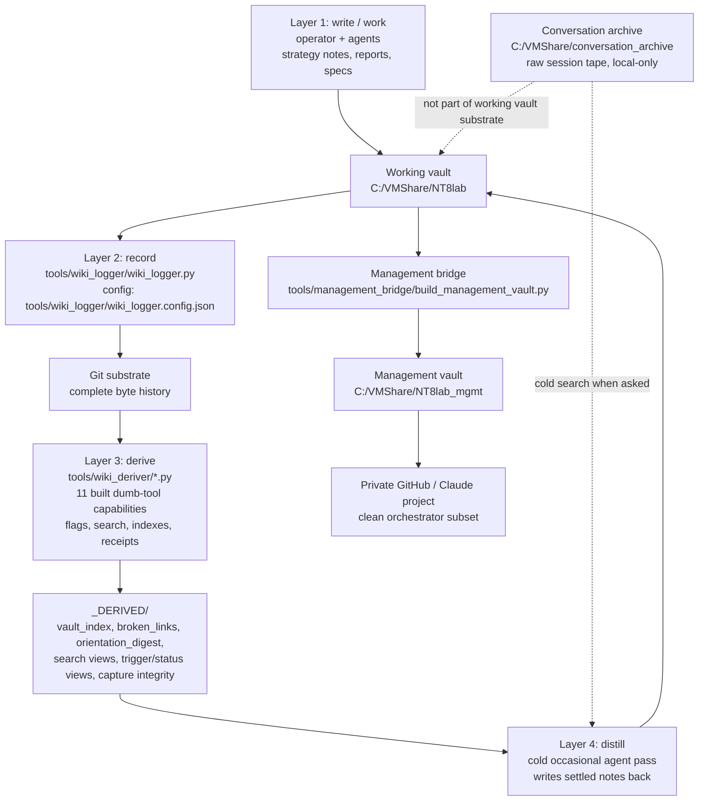
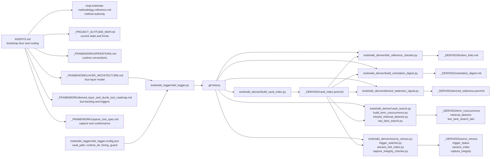

# Wiki Architecture Flow Map

Open `_FRAMEWORK/wiki_architecture_flow.canvas` for the zoomable/clickable
version. This Markdown note is the readable companion.

## Mental Model

This is not a TensorFlow model, but it is a graph architecture. The nodes are
files, tools, vaults, and derived views. The edges are disciplined flows:
write, record, derive, distill, bridge, and cold-search.

The load-bearing rule:

```text
Capture is irreversible. Retrieval is improvable.
```

## High-Level Flow



## Concrete File Spine



## Layer Inventory

### Layer 1 - Write

Main routing files:

- `AGENTS.md` - bootstrap order, working directories, archive routing, Git/logger abstraction.
- `ninja-traitorate-methodology-reference.md` - methodology authority.
- `_PROJECT_ALTITUDE_MAP.md` - broad current-state map.
- `_FRAMEWORK/PATTERNS.md` - project-agnostic research-with-agents patterns.
- `_FRAMEWORK/OPERATIONS.md` - operational conventions.

Snippet-level summary:

```text
AGENTS.md routes agents to the durable authorities and tells them not to
foreground Git/logger mechanics in ordinary work.
```

### Layer 2 - Record

Tool:

- `tools/wiki_logger/wiki_logger.py`

Config:

- `tools/wiki_logger/wiki_logger.config.json`

Key fields:

```text
vault_path, runtime_dir, poll_interval_sec, debounce_window_sec,
periodic_safety_sec, guard_total_commit_mb, guard_single_file_mb
```

Role:

```text
The logger captures settled file states into Git. It does not understand
meaning. It commits bytes.
```

### Layer 3 - Derive

Built dumb-tool capabilities:

1. `tools/wiki_deriver/build_vault_index.py` - all-file index and basename collision surface.
2. `tools/wiki_deriver/link_reference_checker.py` - broken/ambiguous reference checker.
3. `tools/wiki_deriver/build_orientation_digest.py` - deterministic ground-truth orientation snapshot.
4. `tools/wiki_deriver/derived_staleness_signal.py` - flags stale `_DERIVED/` views.
5. `tools/wiki_deriver/source_census.py` - external-source/event census.
6. `tools/wiki_deriver/trigger_watcher.py` - booked-trigger status dashboard.
7. `tools/wiki_deriver/session_link_index.py` - session/report/archive link index.
8. `tools/wiki_deriver/build_term_cooccurrence.py` - corpus-derived term overlap table.
9. `tools/wiki_deriver/missed_retrieval_detector.py` - retrieval benchmark / miss detector.
10. `tools/wiki_deriver/vault_search.py` with `two_lane_search.py` and `vault_search.ps1` - agent search door over vault and periphery lanes.
11. `tools/wiki_deriver/capture_integrity_checker.py` - provenance/capture-gap flagger.

Support files not counted as separate capabilities:

- `tools/wiki_deriver/retrieval_common.py` - shared corpus/scoring helper.
- `tools/wiki_deriver/*.config.json` - config-owned roots, thresholds, and deny-lists.

Adjacent environment dumb tool:

- `deps/tools/render_catalog.py` - dependency manifest/catalog renderer for roadmap 5.1. It follows the same dumb-tool rules but lives in the environment-reconstitution track rather than the wiki-deriver track.

Outputs:

- `_DERIVED/vault_index.json`
- `_DERIVED/vault_index.md`
- `_DERIVED/broken_links.md`
- `_DERIVED/orientation_digest.md`
- `_DERIVED/derived_staleness.json`
- `_DERIVED/derived_staleness.md`
- `_DERIVED/source_census.json/md`
- `_DERIVED/trigger_status.json/md`
- `_DERIVED/session_index.json/md`
- `_DERIVED/retrieval_detector*.json/md`
- `_DERIVED/term_cooccurrence.json/md`
- `_DERIVED/two_lane_search_last.json/md`
- `_DERIVED/capture_integrity.json/md`

Role:

```text
Dumb tools compute views from the vault. They flag and tabulate; they never
fix or interpret.
```

### Layer 4 - Distill

Status:

```text
Booked concept, not a constantly running tool.
```

Role:

```text
A cold agent reads committed material and derived views, then writes settled
notes back into the working wiki with source links. It is occasional, cited,
and separate from warm working context.
```

## Adjacent Vaults

### Management Vault

Path:

```text
C:/VMShare/NT8lab_mgmt
```

Bridge tools:

- `tools/management_bridge/build_management_vault.py`
- `tools/management_bridge/management_auto_sync.py`
- `tools/management_bridge/management_vault_config.json`
- `tools/management_bridge/management_auto_sync_config.json`

Role:

```text
The management bridge exports an allow-listed clean subset to the management
vault and private GitHub/Claude project. It is one-way. It must not push or
mirror raw working-vault material broadly.
```

### Conversation Archive

Path:

```text
C:/VMShare/conversation_archive
```

Decision record:

- `_FRAMEWORK/conversation_archive_decision_record.md`

Capture spec:

- `_FRAMEWORK/capture_tool_spec.md`

Role:

```text
Raw conversation/session tape lives outside the working vault. Search it cold
when asked about prior discussions. Extracts and scratch go in codex_tmp/,
which is untracked.
```

## Read This With The Canvas

Use the Canvas when you want to zoom around the system visually:

- `_FRAMEWORK/wiki_architecture_flow.canvas`

Use this Markdown note when you want the concise text explanation and Mermaid
views.
